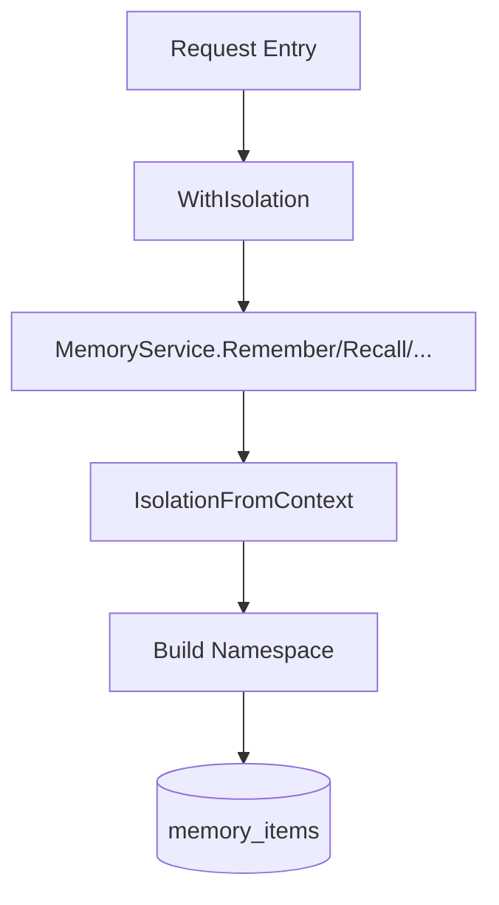

# Agent / Session 隔离最小改造方案（ctxKey 版）

> 目标：在不大改现有 `MemoryService` 方法签名的前提下，引入 `tenant/user/session/agent` 隔离能力。  
> 核心做法：通过 `context.Context` 传递隔离元数据，服务层统一读取并生成 `namespace`。

---

## 1. 设计目标

- 不新增 `Remember/Recall/List/Forget` 的参数（继续使用现有签名）
- 不强依赖数据库 schema 变更（优先复用 `namespace`）
- 强制隔离：不同 tenant / user / session / agent 不串数据
- 调用方接入成本低：只需在请求入口注入 context

---

## 2. 方案概览



说明：
- 上层（HTTP/gRPC/Agent Runtime）负责把隔离信息写入 `ctx`
- `MemoryService` 内部统一读取 `ctx` 并做校验
- `namespace` 由服务层生成，避免调用方手写导致越权或串话

---

## 3. Context Key 设计（私有类型）

必须使用私有 key 类型，避免与其他包冲突：

```go
type ctxKey string

const (
    ctxKeyTenantID  ctxKey = "tenant_id"
    ctxKeyUserID    ctxKey = "user_id"
    ctxKeySessionID ctxKey = "session_id"
    ctxKeyAgentID   ctxKey = "agent_id"
)
```

建议新增 helper：

```go
func WithIsolation(ctx context.Context, tenantID, userID, sessionID, agentID string) context.Context
```
推荐统一使用 `WithIsolation(...)`，避免遗漏必填字段。

---

## 4. 从 Context 提取隔离信息

建议统一使用：

```go
type IsolationMeta struct {
    TenantID  string
    UserID    string
    SessionID string
    AgentID   string
}

func IsolationFromContext(ctx context.Context) (IsolationMeta, error)
```

校验规则（推荐）：
- `TenantID` 必填
- `UserID` 必填
- `SessionID` 必填（用于短期会话隔离）
- `AgentID` 必填（用于同会话多 agent 隔离）
- 任一缺失直接返回 `CodeValidation` 错误

---

## 5. Namespace 约定（不改表结构）

复用现有 `memory_items.namespace`，按 `NamespaceType` 生成路径：

- `transient`  
  `tenant/{tenant}/user/{user}/session/{session}/agent/{agent}/transient`
- `profile`  
  `tenant/{tenant}/user/{user}/profile`
- `action`  
  `tenant/{tenant}/user/{user}/action`
- `knowledge`  
  `tenant/{tenant}/user/{user}/knowledge`

这样可确保：
- 同用户跨 session：仅长期记忆可共享
- 同 session 多 agent：短期上下文互不污染
- 不同 tenant：天然硬隔离（通过 namespace 前缀）

---

## 6. 服务层接入点（最小变更）

在以下入口统一注入隔离逻辑：

- `Remember(ctx, req)`：内部按 `ctx + NamespaceType` 生成，调用方不再控制 `Namespace`
- `Recall(ctx, req)`：若调用方未指定 namespace，默认限制到当前隔离域
- `List(ctx, req)`：同 Recall
- `Forget(ctx, req)`：默认仅允许删除当前隔离域数据

推荐规则（迁移期）：
- 第一阶段：外部传入 `req.Namespace` 时默认拒绝（防绕过隔离）
- 第二阶段：删除 `RememberRequest.Namespace` 字段，彻底移除外部输入入口
- `DedupeKey` 加隔离前缀：`{tenant}:{user}:{session}:{agent}:{rawKey}`

---

## 7. 最小调用示例

```go
ctx := context.Background()
ctx = WithIsolation(ctx, "t1", "u100", "s20260427", "planner")

id, err := svc.Remember(ctx, service.RememberRequest{
    NamespaceType: model.NamespaceTypeTransient,
    Content:       "用户偏好中文回答",
    SourceType:    model.SourceTypeUser,
})
_ = id
_ = err
```

---

## 8. 测试建议（隔离回归）

- 同 `tenant/user` 不同 `session` 的 `transient` 互不可见
- 同 `session` 不同 `agent` 的 `transient` 互不可见
- `profile/knowledge/action` 在同用户跨 session 可见
- 缺 `tenant/user/session/agent` 任意字段时请求失败
- 迁移第一阶段：外部传 `req.Namespace` 时被拒绝
- 迁移第二阶段：编译期已不存在 `req.Namespace` 字段

---

## 9. 迁移与兼容策略（两阶段）

- 第一阶段（兼容期）：
  - 新增 ctx helper 与隔离读取逻辑，不改 DB schema
  - 保留 `RememberRequest.Namespace` 字段，但外部传值直接报错
  - 目的：先阻断绕过路径，同时不立即破坏全部调用方编译
- 第二阶段（收口期）：
  - 删除 `RememberRequest.Namespace` 字段
  - 全仓调用统一改为 `ctx + NamespaceType` 驱动
  - 对外语义收敛为“namespace 永远由服务层生成”
- 后续增强（可选）：
  - 事件审计（写入 `actor`/`request_id` 等字段）
  - 若未来需要高性能租户隔离，再考虑新增显式列和索引

---

## 10. 当前实现状态（第一阶段）

已落地（代码）：
- 新增私有 `ctxKey` 与 helper：`WithIsolation`
- 新增 `IsolationFromContext(ctx)` 与 `IsolationMeta`
- `Remember/Recall/List/Forget` 已接入 context 隔离逻辑
- 根包已重导出上述 helper

当前行为（兼容模式）：
- 仅当 `ctx` 中出现任一隔离字段时，才启用隔离模式
- 启用隔离模式后：
  - `Remember` 禁止外部传 `req.Namespace`，由服务层生成
  - `Recall/List` 禁止外部传 `Namespaces`，由服务层自动限域
  - `Forget` 禁止外部传 `req.Namespace`，由服务层自动限域
- 若启用隔离模式但缺少必填字段（`tenant/user/session/agent`），返回校验错误

说明：
- 这样可以保证老调用方（不注入 ctx 隔离字段）行为不变
- 新调用方可按隔离方案逐步迁移，不需要一次性改全量代码

---

## 11. 第二阶段迁移清单（删除 Namespace 字段前）

> 目标：在删除 `RememberRequest.Namespace` 与隔离模式下的 `RecallRequest.Namespaces` 依赖前，先完成调用方迁移。

### 11.1 迁移优先级

1) `examples/*`（对外示例，优先体现新用法）  
2) `service/*_test.go`（核心行为测试）  
3) `test/*`（集成与回归测试）  
4) `service/extractor.go`、`service/decision.go`（内部自动写入路径）

### 11.2 已扫描到的主要调用点

`RememberRequest.Namespace` 主要分布：
- `examples/01_basic/main.go`
- `examples/02_dedupe/main.go`
- `examples/03_ttl/main.go`
- `examples/04_callback/main.go`
- `examples/06_policy/main.go`
- `examples/07_server_init/main.go`
- `examples/example_test.go`
- `service/memory_test.go`
- `test/memory_crud_test.go`
- `test/chinese_search_test.go`
- `test/ttl_test.go`
- `test/maintenance_test.go`
- `test/concurrent_sqlite_test.go`
- `test/dedupe_test.go`
- `test/decision_test.go`

`RecallRequest.Namespaces` 主要分布：
- `examples/01_basic/main.go`
- `examples/02_dedupe/main.go`
- `examples/03_ttl/main.go`
- `examples/example_test.go`
- `service/memory_test.go`
- `test/memory_crud_test.go`
- `test/chinese_search_test.go`
- `test/ttl_test.go`
- `test/maintenance_test.go`
- `test/concurrent_sqlite_test.go`
- `test/dedupe_test.go`

### 11.3 每类调用点的替换规则

- `RememberRequest.Namespace`
  - 旧：手工传 `Namespace`
  - 新：只传 `NamespaceType`，并在入口注入 `WithIsolation`

- `RecallRequest.Namespaces`
  - 旧：手工传 `Namespaces`
  - 新：不传 `Namespaces`，改用 `NamespaceTypes`（可选）+ ctx 自动限域

- `ForgetRequest.Namespace`
  - 旧：按字符串 namespace 删除
  - 新：优先用 `NamespaceType` + ctx 自动限域；如需批量清理，走内部管理接口

### 11.4 推荐执行顺序

1. 先迁移 `examples/*`，确保文档与示例一致  
2. 再迁移 `service/*_test.go` 与 `test/*`，确保回归覆盖新行为  
3. 最后处理内部自动写入路径（`extractor/decision`）  
4. 全量通过后，删除 `RememberRequest.Namespace` 字段并修正编译错误

### 11.5 示例迁移进度

- 已迁移：
  - `examples/01_basic/main.go`
  - `examples/02_dedupe/main.go`
  - `examples/03_ttl/main.go`
  - `examples/04_callback/main.go`
  - `examples/06_policy/main.go`
  - `examples/example_test.go`
- 暂不迁移：
  - `examples/08_extract_demo/main.go`（使用 `service` 子包直连，已注入 `WithIsolation`）
- 无需迁移（不使用 `MemoryService.Remember/Recall` namespace 输入）：
  - `examples/05_extract/main.go`

