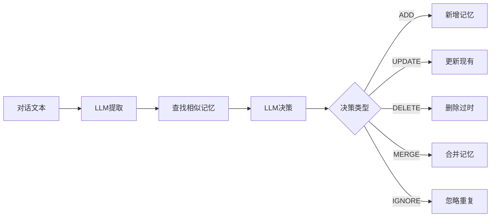

# Decision Engine 使用指南

本文档介绍 Memory 系统中新增的**决策引擎**功能，实现 `提取 → 查相似 → 决策 → 写入` 流程和记忆合并能力。

## 背景

传统记忆提取直接写入，会导致：
- 重复记忆堆积
- 过时信息未清理
- 相关记忆分散

决策引擎通过智能决策解决这些问题。

## 新流程对比

### 传统流程
```
对话文本 → LLM提取 → 直接写入数据库
```

### 决策引擎流程


## 使用方式

### 1. 基础使用（启用决策引擎）

```go
extractor := service.NewExtractor(db)

result, err := extractor.Extract(ctx, service.ExtractRequest{
    DialogText:        "用户对话内容...",
    UseDecisionEngine: true,  // 启用新流程
    SimilarTopK:       5,     // 每个候选查找5条相似记忆
})

if result.DecisionResult != nil {
    fmt.Printf("新增: %v\n", result.DecisionResult.Added)
    fmt.Printf("更新: %v\n", result.DecisionResult.Updated)
    fmt.Printf("合并: %v\n", result.DecisionResult.Merged)
    fmt.Printf("忽略: %v\n", result.DecisionResult.Ignored)
    fmt.Printf("删除: %v\n", result.DecisionResult.Deleted)
}
```

### 2. 决策引擎独立使用

```go
// 初始化决策引擎
decisionEngine := service.NewDecisionEngine(db)

// 1. 查找相似记忆
similar, err := decisionEngine.FindSimilarMemories(ctx, candidate, 5)

// 2. 批量决策
decisionReq := service.DecisionRequest{
    Candidates:      candidates,
    SimilarMemories: similar,
    DialogContext:   dialogText,
}

decisionResult, err := decisionEngine.Decide(ctx, llmConfig, decisionReq)

// 3. 执行决策
execResult, err := decisionEngine.ExecuteDecisions(ctx, candidates, decisionResult.Decisions)
```

### 3. 保留传统方式

```go
// 不启用决策引擎，保持原有行为
result, err := extractor.Extract(ctx, service.ExtractRequest{
    DialogText:        "用户对话内容...",
    UseDecisionEngine: false, // 默认行为
})
```

## 决策类型说明

| 决策 | 说明 | 场景 |
|------|------|------|
| **ADD** | 新增记忆 | 无相关记忆，或主题不同 |
| **UPDATE** | 更新现有 | 同一主题，新信息更准确完整 |
| **DELETE** | 删除过时 | 新信息直接矛盾，旧信息过时 |
| **MERGE** | 合并记忆 | 同一主题，合并多个来源信息 |
| **IGNORE** | 忽略 | 重复、低价值或无关信息 |

## 记忆合并示例

### 场景1：技能信息聚合

**现有记忆**: "用户擅长 Go 语言"

**新提取**: "用户熟练使用 Go 进行后端开发，了解并发编程"

**决策**: MERGE

**结果**: "用户擅长 Go 语言，熟练使用 Go 进行后端开发，了解并发编程"

### 场景2：偏好更新

**现有记忆**: "用户喜欢深色模式"

**新提取**: "用户更喜欢浅色主题，觉得深色模式眼睛疲劳"

**决策**: UPDATE（或 DELETE旧 + ADD新）

**结果**: 更新为 "用户喜欢浅色主题"

### 场景3：去重

**现有记忆**: "用户在北京工作"

**新提取**: "用户在北京上班"

**决策**: IGNORE（语义重复）

## 相似度计算

决策引擎使用多维度相似度：

```
相似度 = 0.4 × 标签重叠度 + 0.6 × 文本Jaccard相似度
```

- 相似度 > 0.8：考虑 UPDATE / DELETE / MERGE
- 相似度 0.3-0.8：可能 MERGE 或独立 ADD
- 相似度 < 0.3：通常 ADD

## 数据库表

### memory_merges 表

由 `model.MemoryMerge` 经 `memory.Migrate`（GORM `AutoMigrate`）创建。记录所有合并操作，用于审计和回溯：

| 字段 | 说明 |
|------|------|
| target_id | 被合并的目标记忆ID |
| source_content | 合并进来的内容 |
| merged_content | 合并后的内容 |
| merge_type | 'auto' (LLM决策) 或 'manual' |
| reason | 合并原因 |

## 配置建议

### 何时启用决策引擎？

| 场景 | 建议 |
|------|------|
| 对话质量高、信息密集 | ✅ 启用 |
| 频繁对话、记忆积累多 | ✅ 启用 |
| 简单问答、低频交互 | ❌ 保持简单 |
| 成本敏感 | ❌ 会额外调用LLM |

### SimilarTopK 设置

| 值 | 适用场景 |
|----|----------|
| 3 | 记忆库小、快速决策 |
| 5 | 平衡精度与速度（推荐） |
| 10 | 记忆库大、需要全面比较 |

## 成本考量

启用决策引擎会增加一次 LLM 调用：

- **提取调用**: 分析对话 → 提取记忆
- **决策调用**: 对比候选与相似记忆 → 做出决策

预估成本增加 ~50-100%（取决于候选数量和相似记忆数量）。

## 故障处理

决策引擎失败时会自动降级为传统模式：

```go
if err != nil {
    fmt.Printf("Decision engine persist failed: %v\n", err)
    // Fallback to simple persist
    for _, mem := range filtered {
        if err := e.persistMemory(ctx, mem); err != nil {
            fmt.Printf("Fallback persist failed: %v\n", err)
        }
    }
}
```

## 未来扩展

- **向量相似度**: 集成 embedding 计算更准确的语义相似度
- **记忆图谱**: 基于实体关系做更智能的合并决策
- **批量合并**: 自动发现历史记忆中可合并的组
- **合并策略配置**: 允许用户自定义合并规则
