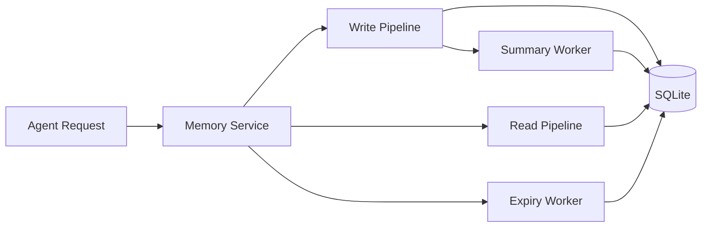
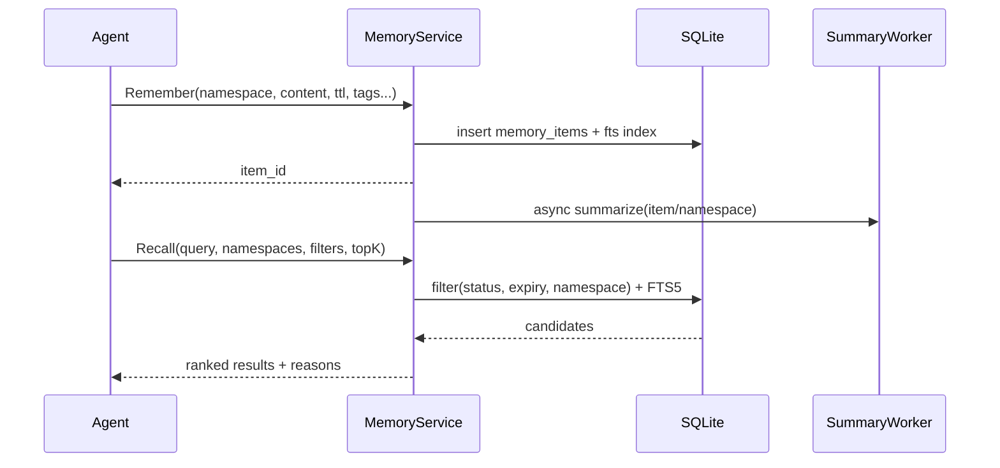
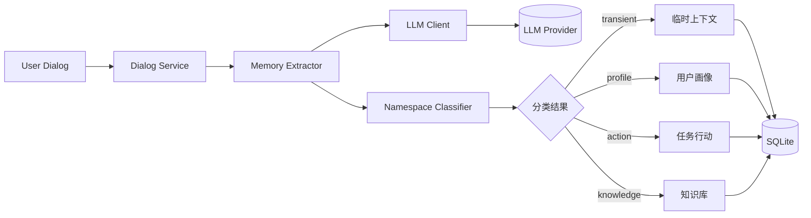
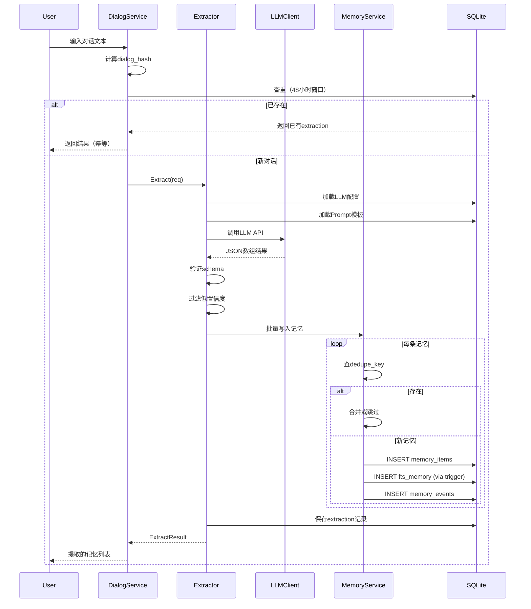

# OpenClaw Memory Hub（方案1）技术方案 v0.2

> 面向个人用户、供 AI Agent 使用的本地记忆系统  
> 技术基线：**Go + SQLite(FTS5) + JSON 元数据**（无向量库）
> 
> **v0.2 关键改进**：并发控制（乐观锁）、幂等写入、滑动TTL、可恢复删除、结构化评分解释、FTS维护机制
>
> **v0.3 新增**：LLM配置管理、对话自动提取与智能分类（transient/profile/action/knowledge）

---

## 1. 目标与范围

### 1.1 目标
- 支持多 namespace 分层存储（简化4类）：
  - `transient`（临时/会话上下文）
  - `profile`（用户画像）
  - `action`（任务/行动项）
  - `knowledge`（知识/技能/流程）
- 支持 TTL/过期管理
- 支持摘要（summary）生成与更新
- 提供 Agent 可调用的统一 Memory API
- 本地优先、单用户、低运维

### 1.2 非目标（第一阶段不做）
- 多租户权限系统
- 分布式部署
- 向量检索
- 跨设备实时同步
- 复杂的LLM记忆冲突解决（仅记录冲突）

---

## 2. 架构总览



### 2.1 核心组件
- `Memory Service`：统一读写入口
- `Write Pipeline`：规范化、去重、写入、索引
- `Read Pipeline`：条件过滤 + FTS 召回 + 排序
- `Summary Worker`：分层摘要（item/namespace）
- `Expiry Worker`：过期回收（硬删或软删）

---

## 3. 命名空间与分层模型

### 3.1 Namespace 设计（简化 4 类）

每条记忆必须属于一个 namespace，简化为 4 个核心类别：

| Namespace | 说明 | 示例 | 默认 TTL |
|-----------|------|------|----------|
| `transient` | 临时/会话上下文 | "用户刚才说要去吃饭" | sliding 3 天 |
| `profile` | 用户画像/偏好 | "用户喜欢深色主题" | manual（不过期） |
| `action` | 任务/待办/行动项 | "完成Q3报告" | fixed 90 天 |
| `knowledge` | 知识/技能/流程 | "Go的goroutine原理"、"部署SOP" | manual（不过期） |

层级路径格式：
- `transient/<session_id>`
- `profile/<user_id>`
- `action/<project>/<task_id>`
- `knowledge/<domain>/<topic>`

### 3.2 访问规则（优先级）
读取默认优先级（可配置）：
1. `transient` - 近期会话上下文
2. `action` - 当前任务/行动项
3. `profile` - 用户长期偏好
4. `knowledge` - 知识库

> 解释：从短期上下文 → 当前行动 → 长期画像 → 知识库。

---

## 4. 数据模型（SQLite）

### 4.1 表结构（建议）

#### `memory_items`
- `id` TEXT PK（ULID/UUID）
- `namespace` TEXT NOT NULL（如 `action/projA/t123`）
- `namespace_type` TEXT NOT NULL（枚举：transient/profile/action/knowledge）
- `title` TEXT
- `content` TEXT NOT NULL（主文本）
- `summary` TEXT（条目摘要）
- `tags_json` TEXT（JSON 数组）
- `source_type` TEXT（user/agent/import/system）
- `source_ref` TEXT（关联来源：文件、消息ID等）
- `importance` INTEGER DEFAULT 0（0-100）
- `confidence` REAL DEFAULT 1.0（0-1）
- `status` TEXT DEFAULT 'active'（active/expired/archived/deleted）
- `expires_at` DATETIME NULL
- `created_at` DATETIME NOT NULL
- `updated_at` DATETIME NOT NULL
- `last_access_at` DATETIME NULL
- `access_count` INTEGER DEFAULT 0
- `version` INTEGER DEFAULT 1
- `dedupe_key` TEXT NULL（namespace内唯一，用于幂等写入）
- `embedding_ref` TEXT NULL（预留：外键关联embedding表）

#### `memory_links`
- `id` TEXT PK
- `from_id` TEXT NOT NULL
- `to_id` TEXT NOT NULL
- `link_type` TEXT NOT NULL（supports/contradicts/derived_from/related_to/supersedes）
- `weight` REAL DEFAULT 1.0
- `created_at` DATETIME NOT NULL
- `reason_json` TEXT NULL（关联原因/置信度详情）

#### `namespace_summaries`
- `id` TEXT PK
- `namespace` TEXT UNIQUE NOT NULL
- `summary` TEXT NOT NULL
- `item_count` INTEGER NOT NULL
- `window_start` DATETIME NULL
- `window_end` DATETIME NULL
- `updated_at` DATETIME NOT NULL

#### `namespace_policies`（策略持久化）
- `namespace` TEXT PK（或前缀匹配如 `action/projA/*`）
- `ttl_seconds` INTEGER NULL（NULL表示不过期）
- `ttl_policy` TEXT DEFAULT 'fixed'（fixed|sliding|manual）
- `sliding_ttl_threshold` INTEGER DEFAULT 3（滑动TTL触发阈值：访问N次续期）
- `summary_enabled` BOOLEAN DEFAULT 1
- `summary_item_token_threshold` INTEGER DEFAULT 500
- `rank_weights_json` TEXT DEFAULT '{"fts":0.55,"recency":0.20,"importance":0.15,"confidence":0.10}'
- `default_top_k` INTEGER DEFAULT 10
- `created_at` DATETIME NOT NULL
- `updated_at` DATETIME NOT NULL

> 策略匹配优先级：精确匹配 > 前缀最长匹配 > 类型默认（transient/action/profile/knowledge）> 全局默认

#### `memory_events`（审计/可回放/追踪）
- `id` TEXT PK
- `item_id` TEXT
- `event_type` TEXT（create/update/read/expire/delete/summarize/restore/conflict_detected）
- `actor` TEXT NULL（agent_id/user_id/system）
- `trace_id` TEXT NULL（分布式追踪ID）
- `request_id` TEXT NULL（幂等请求ID，用于去重和审计）
- `payload_json` TEXT
- `created_at` DATETIME NOT NULL

#### `fts_memory`（FTS5 虚表）
- `item_id` UNINDEXED
- `title`
- `content`
- `summary`
- `tags_text`

> 用 trigger 保持 `memory_items` 与 `fts_memory` 同步。

#### `deleted_items`（软删/可恢复）
- `id` TEXT PK（原item_id）
- `original_data_json` TEXT NOT NULL（完整备份，含FTS索引字段）
- `deleted_at` DATETIME NOT NULL
- `purge_after` DATETIME NOT NULL（物理删除时间，默认7天后）
- `deleted_by` TEXT NULL
- `reason` TEXT NULL

---

## 5. 过期（TTL）设计

### 5.1 TTL 策略
- 写入时支持：
  - 绝对过期：`expires_at`
  - 相对过期：`ttl_seconds`（服务层换算为 `expires_at`，优先级低于namespace_policies）
- **TTL Policy 类型**：
  - `fixed`（默认）：写入时计算固定过期时间，不随访问变化
  - `sliding`：访问续期模式，每次访问延长`ttl_seconds`；可配置`sliding_ttl_threshold`防止无限续期
  - `manual`：永不过期，需显式调用`Expire()`
- 默认 TTL（按 namespace 类型，可被`namespace_policies`覆盖）：
  - `transient`: 3~7 天（建议sliding）
  - `action`: 30~90 天（建议fixed）
  - `profile`: 默认manual（不过期）
  - `knowledge`: 默认manual（可手动版本化）

### 5.1.1 Sliding TTL 实现细节
- 触发条件：`access_count % sliding_ttl_threshold == 0` 时续期
- 续期计算：`new_expires_at = now() + ttl_seconds`
- 上限保护：最大续期次数限制（如10次），防无限续期

### 5.2 过期处理模式
- `soft_expire`（默认）：`status=expired`，查询默认不返回，可手动恢复
- `hard_delete`（可选）：移至`deleted_items`表，N天后物理删除（purge_after）
- `immediate_purge`（危险）：直接物理删除，不保留恢复能力

### 5.3 查询与过期约束
查询条件统一包含：
- `status='active'`
- `(expires_at IS NULL OR expires_at > now())`
- 对于`sliding`策略：每次Recall命中时，后台异步触发续期检查（不阻塞返回）

---

## 6. Summary 设计

### 6.1 Summary 分层
1. **Item Summary**：单条记忆摘要（可选自动生成）
2. **Namespace Summary**：命名空间摘要（滚动更新）
3. **Context Summary**：面向当前请求的动态拼接摘要（读时生成，不入库或短期缓存）

### 6.2 Summary 触发策略
- 写入后异步（内容长度超阈值）
- 每 N 条增量更新 namespace summary
- 定时重建（例如每日凌晨）
- 条目更新/过期时触发局部重算

### 6.3 Summary 存储
- item 级写入 `memory_items.summary`
- namespace 级写入 `namespace_summaries.summary`

---

## 7. 读写流程



---

## 8. API 设计（Go 服务接口）

### 8.1 核心接口
- `Remember(req) (itemID, error)`
  - 支持 `dedupe_key` 幂等写入（相同namespace+dedupe_key返回已有item_id）
  - 支持 `request_id` 全局幂等（48小时内重复请求返回相同结果）
- `Update(req) error`
  - 乐观锁：必须提供 `expected_version`，冲突返回 `ErrConflict`（建议重试或合并）
- `Recall(req) ([]MemoryHit, error)`
  - 支持上下文预算控制：`token_budget` / `max_chars` / `max_items`
  - 返回结构化评分解释：`score_breakdown`
- `Forget(req) (count, error)`
  - 模式：`soft_delete`（移至deleted_items）/ `expire`（标记过期）/ `immediate_purge`（危险）
- `Restore(itemID)`（从deleted_items恢复）
- `Touch(itemID)`（访问计数、最近访问、sliding TTL续期检查）
- `SummarizeNamespace(namespace)`（手动触发）
- `ListNamespaces(prefix)`（层级浏览）
- `SetNamespacePolicy(policy)`（TTL/summary策略持久化到表）
- **运维接口**：
  - `RebuildFTS() (stats, error)`（全量重建FTS索引 + 校验计数）
  - `ValidateFTS() (bool, error)`（校验FTS与主表计数一致）
  - `PurgeDeleted(before time) (count, error)`（清理超期软删数据）

### 8.2 Recall 请求结构（建议）
- `query`：关键词
- `namespaces[]`：指定 namespace 或前缀
- `namespace_types[]`
- `tags_any[]` / `tags_all[]`
- `time_range`
- `include_expired`（默认 false）
- `include_deleted`（默认 false，仅管理员）
- `top_k`
- `context_budget`：上下文预算（`token_budget` 或 `max_chars` 或 `max_items`，三选一）
- `min_confidence`
- `min_importance`
- `request_id`：用于幂等和事件追踪

### 8.3 Recall 返回结构（建议）
- `item_id`
- `namespace`
- `title`
- `snippet`
- `score`（最终综合分数，0-1）
- `score_breakdown`（结构化评分解释）：
  - `fts_score`: 0-1（BM25归一化）
  - `recency_score`: 0-1（时间衰减）
  - `importance_score`: 0-1（重要性归一化）
  - `confidence_score`: 0-1（置信度）
  - `access_boost`: 0-0.1（访问频率加成）
- `reason_codes[]`（命中原因标签）：`title_match`/`content_match`/`tag_match`/`recent_access`/`high_importance`
- `conflict_warning`（存在冲突记忆的警告标识）
- `expires_at`
- `source_ref`
- `token_count`（该条目的token数，用于预算管理）

---

## 9. 排序与召回策略（无向量版）

### 9.1 综合分数计算（可配置权重）

`final_score = w_fts*fts_score + w_recency*recency_score + w_importance*importance_score + w_confidence*confidence_score + access_boost`

- `fts_score`：FTS BM25（归一化到0-1）
- `recency_score`：时间衰减（transient/action 更敏感，使用指数衰减 `exp(-λ*Δt)`）
- `importance_score`：`importance/100`
- `confidence_score`：`confidence`（低置信记忆降权）
- `access_boost`：`min(0.1, access_count/100)`（高频访问微调加成）

**默认权重**（可通过`namespace_policies.rank_weights_json`覆盖）：
- `w_fts = 0.55`
- `w_recency = 0.20`
- `w_importance = 0.15`
- `w_confidence = 0.10`

### 9.2 冲突处理策略
- 检测到`contradicts`链接时，标记冲突但默认不自动过滤
- Recall返回增加`conflict_warning`字段
- 调用方可选择：`prefer_latest`（取更新时间最新）/ `prefer_high_confidence`（取高置信度）/ `return_all`（返回全部冲突项）

### 9.3 FTS 维护与校验
- **自动同步**：通过SQLite trigger保持`memory_items`与`fts_memory`同步
- **重建命令**：`RebuildFTS()`全量重建（schema变化或数据不一致时）
- **校验机制**：`ValidateFTS()`比对主表与FTS表计数，不一致则告警并触发重建
- **监控指标**：FTS延迟（trigger执行时间）、重建耗时、校验失败次数

---

## 10. 配置项（建议）

`config.yaml` 示例字段（逻辑）：
- `db.path`
- `db.wal_enabled`（true，性能优先）
- `expiry.mode` (`soft`/`hard`/`immediate_purge`)
- `expiry.gc_interval`
- `expiry.purge_after_days`（软删保留天数，默认7）
- `expiry.max_sliding_extensions`（最大滑动续期次数，默认10）
- `summary.enabled`
- `summary.item_token_threshold`
- `summary.namespace_batch_size`
- `recall.default_top_k`
- `recall.namespace_priority`
- `recall.default_context_budget`（默认token预算）
- `recall.max_context_budget`（最大预算上限）
- `ttl.default_by_namespace_type`（各类型默认策略）
- `concurrency.optimistic_lock_retries`（乐观锁冲突重试次数，默认3）
- `idempotency.request_id_ttl_hours`（request_id幂等窗口，默认48）
- `fts.auto_rebuild_on_mismatch`（校验失败自动重建，默认true）
- `fts.rebuild_timeout_minutes`

---

## 11. Repo 初始化建议

```text
openclaw-memory-hub/
  cmd/server/
  internal/
    api/
    service/
    store/sqlite/
    summary/
    expiry/
    ranking/
    model/
  migrations/
  configs/
  tests/
  docs/
    architecture.md
    api.md
    schema.md
```

---

## 12. 里程碑（建议）

### M1（1-2周）核心存储与基础API
- SQLite schema + migration（含v0.2新增表：namespace_policies, deleted_items, events增强字段）
- Remember/Recall/Forget 基础功能（含dedupe_key幂等、request_id幂等窗口）
- FTS5 检索 + namespace 过滤 + trigger自动同步
- **并发控制**：乐观锁实现（Update接口 + version字段校验）
- 软过期 + 可恢复删除机制

### M2（第3周）智能排序与摘要
- Summary Worker（item + namespace）
- **排序增强**：结构化评分解释（score_breakdown + reason_codes）
- **滑动TTL实现**：访问续期逻辑 + sliding_ttl_threshold
- 事件审计表（含actor/trace_id/request_id追踪）
- **FTS维护**：RebuildFTS/ValidateFTS运维接口

### M3（第4周）策略配置与可靠性
- **策略配置中心**：namespace_policies表 + SetNamespacePolicy接口
- 压测与数据恢复（备份/恢复 + RPO/RTO验证）
- **并发测试**：10并发写入压力测试 + 幂等性验证
- 接入 OpenClaw Agent 工具调用
- **监控指标**：FTS延迟、校验失败率、TTL续期统计

---

## 13. 验收标准（Definition of Done）

### 13.1 功能验收
- 多 namespace 分层查询可用
- 过期后默认不可召回，**支持从`deleted_items`恢复**
- summary 自动生成并可被召回展示
- **并发更新**：乐观锁冲突时能正确返回错误码，支持重试
- **幂等写入**：相同`dedupe_key`或`request_id`重复调用返回相同结果，不重复写入
- **Recall可解释性**：返回`score_breakdown`和`reason_codes`，便于调参和问题排查
- **Sliding TTL**：高频访问的transient记忆能自动续期，不机械过期
- **FTS可靠性**：校验失败时自动重建，重建后数据一致

### 13.2 性能与可靠性
- 10 万条本地数据下 Recall P95 < 150ms（单机基线目标）
- 1万条写入/小时下，FTS同步延迟 P99 < 10ms
- WAL模式崩溃恢复后数据一致性验证通过
- **RPO/RTO目标**：`RPO <= 5min`（WAL + 定期快照），`RTO <= 15min`

### 13.3 测试与可观测
- API 单元测试覆盖核心路径（>80% 逻辑覆盖）
- **并发测试**：模拟10并发写入同一namespace，验证无丢失/覆盖
- **幂等测试**：重复request_id请求，验证返回相同item_id
- **事件追踪验证**：通过`memory_events`能完整回放任意记忆的生命周期
- **FTS校验**：主表与FTS表计数差异为0

---

## 14. LLM集成与自动提取（v0.3）

### 14.1 目标
- 支持配置多个 LLM Provider（OpenAI、Claude、本地模型等）
- 用户输入对话，系统自动提取记忆并分类到不同 namespace
- 使用结构化输出（JSON Mode）确保提取结果可直接写入数据库

### 14.2 架构增强



### 14.3 数据模型扩展

#### `llm_configs`（LLM配置表）
- `id` TEXT PK
- `name` TEXT NOT NULL（配置名称，如 "openai-gpt4"）
- `provider` TEXT NOT NULL（openai/anthropic/ollama/custom）
- `api_key` TEXT（加密存储）
- `base_url` TEXT NULL（自定义API端点）
- `model` TEXT NOT NULL（模型ID，如 "gpt-4o"）
- `max_tokens` INTEGER DEFAULT 4096
- `temperature` REAL DEFAULT 0.3（提取任务需要稳定输出）
- `timeout_seconds` INTEGER DEFAULT 30
- `is_default` BOOLEAN DEFAULT 0
- `enabled` BOOLEAN DEFAULT 1
- `created_at` DATETIME NOT NULL
- `updated_at` DATETIME NOT NULL

#### `extraction_prompts`（提取Prompt模板）
- `id` TEXT PK
- `name` TEXT NOT NULL（模板名称）
- `version` INTEGER DEFAULT 1
- `system_prompt` TEXT NOT NULL
- `json_schema` TEXT NOT NULL（结构化输出schema）
- `is_default` BOOLEAN DEFAULT 0
- `created_at` DATETIME NOT NULL
- `updated_at` DATETIME NOT NULL

#### `dialog_extractions`（提取记录）
- `id` TEXT PK
- `dialog_text` TEXT NOT NULL（原始对话内容）
- `dialog_hash` TEXT NOT NULL（用于幂等检测）
- `llm_config_id` TEXT NOT NULL
- `prompt_id` TEXT NOT NULL
- `extracted_memories_json` TEXT NOT NULL（提取结果数组）
- `total_tokens` INTEGER
- `cost_estimate` REAL（估算成本USD）
- `processing_time_ms` INTEGER
- `status` TEXT（pending/processing/completed/failed）
- `error_message` TEXT
- `created_at` DATETIME NOT NULL

### 14.4 分类策略（6类Namespace）

LLM提取器需要判断每条记忆属于哪类：

| Namespace | 分类规则 | 示例 | 默认TTL |
|-----------|----------|------|---------|
| `transient` | 当前会话上下文，临时信息，短期有效 | "用户刚才说要去吃饭"、"刚才讨论了项目进度" | sliding 3天 |
| `profile` | 用户偏好、个人信息、长期画像 | "用户喜欢深色主题"、"用户是产品经理" | manual |
| `action` | 任务、待办、行动项、有截止日期 | "完成Q3报告"、"修复登录bug" | fixed 90天 |
| `knowledge` | 知识、技能、流程、学到的信息 | "Go的goroutine原理"、"用pprof分析性能"、"部署SOP" | manual |

### 14.5 提取Prompt设计

**系统Prompt示例**：
```
你是一个记忆提取助手。分析以下对话，提取有价值的记忆信息。

CLASSIFICATION RULES (4 categories):
- transient: 临时会话上下文，短期有效，会话结束后逐渐失效
- profile: 用户画像，长期稳定的个人偏好和信息
- action: 需要执行的任务、待办、行动项，有明确目标或截止
- knowledge: 学到的知识、技能、方法、流程

对于每条记忆，请输出：
1. namespace: 只能是 transient/profile/action/knowledge 之一
2. title: 简短的标题（10字以内）
3. content: 详细内容
4. summary: 一句话摘要
5. tags: 相关标签数组
6. importance: 重要性 0-100
7. confidence: 置信度 0.0-1.0
8. reasoning: 分类理由

如果是 action，额外提取：
- deadline: ISO日期或null
- priority: high/medium/low

返回严格的JSON格式: {"memories": [...]}
```

**JSON Schema示例**：
```json
{
  "type": "object",
  "properties": {
    "memories": {
      "type": "array",
      "items": {
        "type": "object",
        "properties": {
          "namespace": {"enum": ["transient", "profile", "action", "knowledge"]},
          "title": {"type": "string", "maxLength": 50},
          "content": {"type": "string"},
          "summary": {"type": "string"},
          "tags": {"type": "array", "items": {"type": "string"}},
          "importance": {"type": "integer", "minimum": 0, "maximum": 100},
          "confidence": {"type": "number", "minimum": 0, "maximum": 1},
          "reasoning": {"type": "string"},
          "task_metadata": {
            "type": "object",
            "properties": {
              "deadline": {"type": "string", "format": "date"},
              "priority": {"enum": ["high", "medium", "low"]}
            }
          }
        },
        "required": ["namespace", "title", "content", "importance", "confidence"]
      }
    }
  },
  "required": ["memories"]
}
```

### 14.6 API设计

#### 对话提取接口
```go
// ExtractRequest 对话提取请求
type ExtractRequest struct {
    DialogText    string            // 原始对话文本
    LLMConfigID   string            // 使用哪个LLM配置（空则使用default）
    PromptID      string            // 使用哪个prompt模板（空则使用default）
    ContextMemories []string        // 相关记忆ID，作为上下文
    MinConfidence float64           // 最低置信度阈值（默认0.7）
    DryRun        bool              // 仅预览，不写入数据库
}

// ExtractResult 提取结果
type ExtractResult struct {
    ExtractionID    string
    Status          string
    Memories        []ExtractedMemory
    TotalTokens     int
    CostEstimate    float64
    ProcessingTime  int // ms
}

// ExtractedMemory 提取的单条记忆
type ExtractedMemory struct {
    TempID      string          // 预览用，正式写入后替换为真实ID
    Namespace   string
    Title       string
    Content     string
    Summary     string
    Tags        []string
    Importance  int
    Confidence  float64
    Reasoning   string
    TTLSeconds  *int            // 可选，覆盖默认策略
}
```

#### LLM配置管理接口
```go
type LLMConfigService interface {
    CreateConfig(cfg LLMConfig) (id string, err error)
    UpdateConfig(id string, cfg LLMConfig) error
    DeleteConfig(id string) error
    GetConfig(id string) (LLMConfig, error)
    ListConfigs() ([]LLMConfig, error)
    SetDefault(id string) error
    TestConfig(id string) (latencyMs int, err error)  // 测试连通性
}
```

### 14.7 流程图



### 14.8 关键实现点

#### 1. LLM Client 抽象
```go
type LLMClient interface {
    Complete(ctx context.Context, req CompletionRequest) (CompletionResponse, error)
    CompleteStructured(ctx context.Context, req StructuredRequest) (StructuredResponse, error)
}

// 实现：OpenAIClient, ClaudeClient, OllamaClient
```

#### 2. 提取后处理
- **置信度过滤**：低于 `min_confidence` 的记忆丢弃或标记待确认
- **去重检测**：使用 `dedupe_key` 检测同 namespace 内相似内容
- **冲突检测**：检查是否 contradicts 现有记忆，创建 memory_links
- **TTL 应用**：根据 namespace 类型应用 policy 中的 TTL 设置

#### 3. 成本优化
- **缓存**：相同 `dialog_hash` 48小时内直接返回缓存结果
- **Token预算**：提取请求可设置 `max_tokens` 限制
- **批量提取**：累积多条短对话后一次性提取

### 14.9 配置示例

```yaml
llm:
  default_config: "openai-gpt4o"
  configs:
    - id: "openai-gpt4o"
      provider: "openai"
      api_key: "${OPENAI_API_KEY}"
      model: "gpt-4o"
      temperature: 0.3
      max_tokens: 4096
    - id: "ollama-local"
      provider: "ollama"
      base_url: "http://localhost:11434"
      model: "llama3.1:8b"
      temperature: 0.2

extraction:
  min_confidence: 0.7
  cache_ttl_hours: 48
  batch_size: 5  # 累积5条消息再提取
  default_prompt: "v1-standard"
```

### 14.10 验收标准

- [ ] 支持至少3种LLM Provider（OpenAI、Claude、Ollama）
- [ ] 对话提取准确率 > 80%（人工抽检100条）
- [ ] 分类到4类namespace的准确率 > 90%
- [ ] 48小时内相同对话哈希返回缓存（幂等）
- [ ] 支持dry-run模式预览提取结果
- [ ] 提取失败时记录详细错误到 `dialog_extractions.error_message`

---

## 附录：v0.1 → v0.2 变更摘要

| 模块 | v0.1 状态 | v0.2 改进 |
|------|-----------|-----------|
| **并发控制** | 仅有`version`字段 | 乐观锁协议 + `ErrConflict`错误码 + 重试策略 |
| **幂等写入** | 无 | `dedupe_key`（namespace内唯一）+ `request_id`（全局48小时窗口） |
| **TTL策略** | 仅fixed | 新增`sliding`（访问续期）+ `manual`（永不过期）+ 续期阈值保护 |
| **删除机制** | soft_expire标记 | `deleted_items`表软删 + `purge_after`可恢复 + 物理清理 |
| **评分解释** | `reason`字符串 | `score_breakdown`结构化JSON + `reason_codes[]`标签 |
| **策略配置** | config.yaml建议 | `namespace_policies`持久化表 + 优先级匹配规则 |
| **FTS维护** | trigger同步一句话 | 重建/校验运维接口 + 自动重建策略 + 监控指标 |
| **事件追踪** | 基础字段 | `actor`/`trace_id`/`request_id`全链路追踪 |
| **上下文预算** | 无 | `token_budget`/`max_chars`/`max_items`召回裁剪 |
| **冲突处理** | links表定义 | 召回冲突检测 + `conflict_warning` + 策略选择 |
| **预留扩展** | 无 | `embedding_ref`字段预留 + `embedding_ref`关联表设计 |
| **LLM集成** | 无 | LLM配置管理 + 对话自动提取 + 智能分类到4类namespace |
| **Namespace简化** | 6类(session/task/profile/kb/skills/sop) | 简化为4类(transient/profile/action/knowledge) |

---

如果你同意这版，我下一步可以直接给你三份可落地文档草稿：
1. `schema.sql`（完整建表+索引+trigger，含v0.2全部表）  
2. `api.md`（请求/响应 JSON Schema + 错误码定义）
3. `impl-notes.md`（Go实现要点：乐观锁、幂等窗口、滑动TTL续期逻辑）
