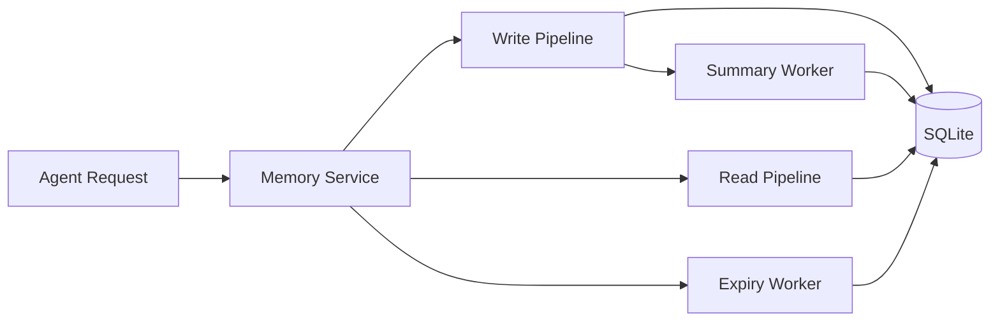
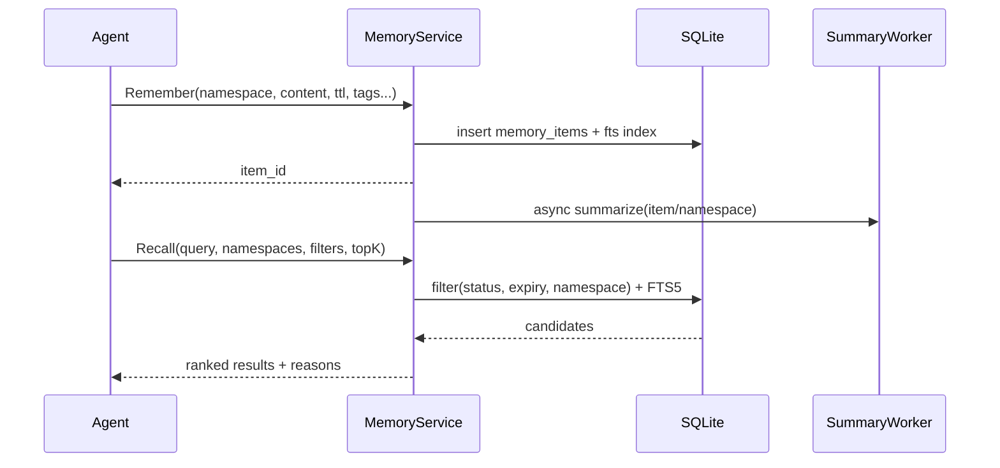

# OpenClaw Memory Hub（方案1）技术方案 v0.2

> 面向个人用户、供 AI Agent 使用的本地记忆系统  
> 技术基线：**Go + SQLite(FTS5) + JSON 元数据**（无向量库）
> 
> **v0.2 关键改进**：并发控制（乐观锁）、幂等写入、滑动TTL、可恢复删除、结构化评分解释、FTS维护机制
>
> **v0.3 新增**：LLM配置管理、对话自动提取与智能分类（transient/profile/action/knowledge）

---

## 1. 目标与范围

### 1.1 目标
- 支持多 namespace 分层存储（简化4类）：
  - `transient`（临时/会话上下文）
  - `profile`（用户画像）
  - `action`（任务/行动项）
  - `knowledge`（知识/技能/流程）
- 支持 TTL/过期管理
- 支持摘要（summary）生成与更新
- 提供 Agent 可调用的统一 Memory API
- 本地优先、单用户、低运维

### 1.2 非目标（第一阶段不做）
- 多租户权限系统
- 分布式部署
- 向量检索
- 跨设备实时同步
- 复杂的LLM记忆冲突解决（仅记录冲突）

---

## 2. 架构总览



### 2.1 核心组件
- `Memory Service`：统一读写入口
- `Write Pipeline`：规范化、去重、写入、索引
- `Read Pipeline`：条件过滤 + FTS 召回 + 排序
- `Summary Worker`：分层摘要（item/namespace）
- `Expiry Worker`：过期回收（硬删或软删）

---

## 3. 命名空间与分层模型

### 3.1 Namespace 设计（简化 4 类）

每条记忆必须属于一个 namespace，简化为 4 个核心类别：

| Namespace | 说明 | 示例 | 默认 TTL |
|-----------|------|------|----------|
| `transient` | 临时/会话上下文 | "用户刚才说要去吃饭" | sliding 3 天 |
| `profile` | 用户画像/偏好 | "用户喜欢深色主题" | manual（不过期） |
| `action` | 任务/待办/行动项 | "完成Q3报告" | fixed 90 天 |
| `knowledge` | 知识/技能/流程 | "Go的goroutine原理"、"部署SOP" | manual（不过期） |

层级路径格式：
- `transient/<session_id>`
- `profile/<user_id>`
- `action/<project>/<task_id>`
- `knowledge/<domain>/<topic>`

### 3.2 访问规则（优先级）
读取默认优先级（可配置）：
1. `transient` - 近期会话上下文
2. `action` - 当前任务/行动项
3. `profile` - 用户长期偏好
4. `knowledge` - 知识库

> 解释：从短期上下文 → 当前行动 → 长期画像 → 知识库。

---

## 4. 数据模型（SQLite）

### 4.1 表结构（建议）

#### `memory_items`
- `id` TEXT PK（ULID/UUID）
- `namespace` TEXT NOT NULL（如 `action/projA/t123`）
- `namespace_type` TEXT NOT NULL（枚举：transient/profile/action/knowledge）
- `title` TEXT
- `content` TEXT NOT NULL（主文本）
- `summary` TEXT（条目摘要）
- `tags_json` TEXT（JSON 数组）
- `source_type` TEXT（user/agent/import/system）
- `source_ref` TEXT（关联来源：文件、消息ID等）
- `importance` INTEGER DEFAULT 0（0-100）
- `confidence` REAL DEFAULT 1.0（0-1）
- `status` TEXT DEFAULT 'active'（active/expired/archived/deleted）
- `expires_at` DATETIME NULL
- `created_at` DATETIME NOT NULL
- `updated_at` DATETIME NOT NULL
- `last_access_at` DATETIME NULL
- `access_count` INTEGER DEFAULT 0
- `version` INTEGER DEFAULT 1
- `dedupe_key` TEXT NULL（namespace内唯一，用于幂等写入）
- `embedding_ref` TEXT NULL（预留：外键关联embedding表）

#### `memory_links`
- `id` TEXT PK
- `from_id` TEXT NOT NULL
- `to_id` TEXT NOT NULL
- `link_type` TEXT NOT NULL（supports/contradicts/derived_from/related_to/supersedes）
- `weight` REAL DEFAULT 1.0
- `created_at` DATETIME NOT NULL
- `reason_json` TEXT NULL（关联原因/置信度详情）

#### `namespace_summaries`
- `id` TEXT PK
- `namespace` TEXT UNIQUE NOT NULL
- `summary` TEXT NOT NULL
- `item_count` INTEGER NOT NULL
- `window_start` DATETIME NULL
- `window_end` DATETIME NULL
- `updated_at` DATETIME NOT NULL

#### `namespace_policies`（策略持久化）
- `namespace` TEXT PK（当前实现为精确匹配，未实现通配符前缀）
- `ttl_seconds` INTEGER NULL（NULL表示不过期）
- `ttl_policy` TEXT DEFAULT 'fixed'（fixed|sliding|manual）
- `sliding_ttl_threshold` INTEGER DEFAULT 3（滑动TTL触发阈值：访问N次续期）
- `summary_enabled` BOOLEAN DEFAULT 1
- `summary_item_token_threshold` INTEGER DEFAULT 500
- `rank_weights_json` TEXT DEFAULT '{"fts":0.55,"recency":0.20,"importance":0.15,"confidence":0.10}'
- `default_top_k` INTEGER DEFAULT 10
- `created_at` DATETIME NOT NULL
- `updated_at` DATETIME NOT NULL

> 策略匹配优先级：精确匹配 > 类型默认（transient/action/profile/knowledge）> 全局默认

#### `memory_events`（审计/可回放/追踪）
- `id` TEXT PK
- `item_id` TEXT
- `event_type` TEXT（create/update/read/expire/delete/summarize/restore/conflict_detected）
- `actor` TEXT NULL（agent_id/user_id/system）
- `trace_id` TEXT NULL（分布式追踪ID）
- `request_id` TEXT NULL（幂等请求ID，用于去重和审计）
- `payload_json` TEXT
- `created_at` DATETIME NOT NULL

#### `fts_memory`（FTS5 虚表）
- `item_id` UNINDEXED
- `title`
- `content`
- `summary`
- `tags_text`

> 用 trigger 保持 `memory_items` 与 `fts_memory` 同步。

#### `deleted_items`（软删/可恢复）
- `id` TEXT PK（原item_id）
- `original_data_json` TEXT NOT NULL（完整备份，含FTS索引字段）
- `deleted_at` DATETIME NOT NULL
- `purge_after` DATETIME NOT NULL（物理删除时间，默认7天后）
- `deleted_by` TEXT NULL
- `reason` TEXT NULL

---

## 5. 过期（TTL）设计

### 5.1 TTL 策略
- 写入时支持：
  - 绝对过期：`expires_at`
  - 相对过期：`ttl_seconds`（服务层换算为 `expires_at`，优先级低于namespace_policies）
- **TTL Policy 类型**：
  - `fixed`（默认）：写入时计算固定过期时间，不随访问变化
  - `sliding`：访问续期模式，每次访问延长`ttl_seconds`；可配置`sliding_ttl_threshold`防止无限续期
  - `manual`：永不过期，需显式调用`Expire()`
- 默认 TTL（按 namespace 类型，可被`namespace_policies`覆盖）：
  - `transient`: 3~7 天（建议sliding）
  - `action`: 30~90 天（建议fixed）
  - `profile`: 默认manual（不过期）
  - `knowledge`: 默认manual（可手动版本化）

### 5.1.1 Sliding TTL 实现细节
- 触发条件：`access_count % sliding_ttl_threshold == 0` 时续期
- 续期计算：`new_expires_at = now() + ttl_seconds`
- 上限保护：最大续期次数限制（如10次），防无限续期

### 5.2 过期处理模式
- `soft_expire`（默认）：`status=expired`，查询默认不返回，可手动恢复
- `hard_delete`（可选）：移至`deleted_items`表，N天后物理删除（purge_after）
- `immediate_purge`（危险）：直接物理删除，不保留恢复能力

### 5.3 查询与过期约束
查询条件统一包含：
- `status='active'`
- `(expires_at IS NULL OR expires_at > now())`
- 对于`sliding`策略：每次Recall命中时，后台异步触发续期检查（不阻塞返回）

---

## 6. Summary 设计

### 6.1 Summary 分层
1. **Item Summary**：单条记忆摘要（可选自动生成）
2. **Namespace Summary**：命名空间摘要（滚动更新）
3. **Context Summary**：面向当前请求的动态拼接摘要（读时生成，不入库或短期缓存）

### 6.2 Summary 触发策略
- 写入后异步（内容长度超阈值）
- 每 N 条增量更新 namespace summary
- 定时重建（例如每日凌晨）
- 条目更新/过期时触发局部重算

### 6.3 Summary 存储
- item 级写入 `memory_items.summary`
- namespace 级写入 `namespace_summaries.summary`

---

## 7. 读写流程



---

## 8. API 设计（当前实现）

以下接口与 `service/memory.go`、`service/extractor.go` 保持一致。

### 8.1 核心接口
- `Remember(ctx, req) (itemID string, err error)`
  - 支持 `dedupe_key`（同 `namespace` 下幂等）
- `Update(ctx, req) error`
  - 需要 `ExpectedVersion` 做乐观锁检查
- `Recall(ctx, req) ([]MemoryHit, error)`
  - 支持 query/namespace/tag/time/confidence/importance 过滤
- `List(ctx, req) ([]MemoryItem, error)`
  - 按 `created_at` 分页和排序
- `Forget(ctx, req) (count int, err error)`
  - `mode` 支持 `soft` / `hard` / `expire`
- `Touch(ctx, itemID) error`
- `TouchWithRenew(ctx, itemID, threshold, ttlSeconds) (renewed bool, err error)`
- `RenewExpiration(ctx, itemID, ttlSeconds) error`
- `CleanupExpired(ctx) (count int64, err error)`
- `PurgeDeleted(ctx, before time.Time) (count int64, err error)`
- `RebuildFTS(ctx) error`

### 8.2 Recall 返回字段（当前实现）
- `MemoryHit` 包含：
  - `Score`
  - `FTSScore`
  - `RecencyScore`
  - `ImportanceScore`
  - `ConfidenceScore`
  - `MatchReasons`

> 当前实现没有 `score_breakdown`、`reason_codes`、`conflict_warning`、`context_budget` 等扩展字段。

---

## 9. 排序与召回策略（当前实现）

排序公式：

`final_score = w_fts*fts_score + w_recency*recency_score + w_importance*importance_score + w_confidence*confidence_score + access_boost`

- `access_boost = min(0.1, access_count/100)`
- 默认权重：`0.55 / 0.20 / 0.15 / 0.10`
- 可通过 `namespace_policies.rank_weights_json` 覆盖

---

## 10. LLM 集成与自动提取（当前实现）

### 10.1 能力范围
- 提供 `Extractor.Extract(ctx, req)` 与 `QuickExtract(...)`
- 运行时使用 `LLMConfig`（代码传入，不落库）
- 使用 OpenAI 兼容 Chat Completions 接口
- 可通过 `OPENAI_BASE_URL` 对接兼容端点（如 Ollama）

### 10.2 相关数据
- `DialogExtraction` 表用于记录提取过程与缓存（48 小时窗口）
- `ExtractionPrompt` 为运行时结构体（代码传入，不落库）

### 10.3 ExtractRequest 关键字段
- `DialogText`
- `MinConfidence`
- `DryRun`
- `UseDecisionEngine`
- `SimilarTopK`
- `ReferenceTime` / `TimeZone` / `ResolutionContext`
- `LLMConfig`（必需）
- `ExtractionPrompt`（可选，空则使用内建默认）

---

## 11. Repo 布局（与实现仓库对齐）

本仓库为库形态：`github.com/lengzhao/memory`。表结构以 `model` 包 GORM 标签为准；`store.Migrate` 执行 `AutoMigrate` 并安装 FTS5 虚表与触发器。

```text
memory/
  examples/
  model/
  service/
  store/
  test/
  docs/
```
