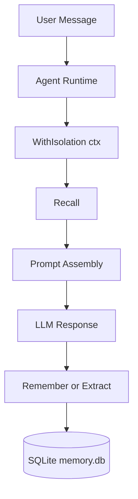

# OpenClaw 系列接入 Memory 模块指南

本文面向 `openclaw` / `picoclaw` / `nanoclaw` 项目，说明如何把当前 `memory` 库稳定接入 Agent 系统，并获得较好的记忆效果。

## 1. 适用场景与目标

- `nanoclaw`（轻量单 Agent）：优先做会话隔离 + 基础 Remember/Recall。
- `picoclaw`（中等复杂度 Agent）：在基础上增加 `Extractor` 自动提取与策略管理。
- `openclaw`（多角色/多任务 Agent）：启用隔离、策略、提取、决策引擎，形成完整闭环。

目标是三件事：
- 写入稳定：同输入不重复、并发下不冲突。
- 召回有效：按会话与用户隔离，优先返回当前任务相关记忆。
- 演进可控：可逐步从“手工记忆”升级到“自动提取+决策”。

## 2. 推荐集成架构



核心原则：
- 所有读写都使用同一个带隔离信息的 `ctx`。
- 先 `Recall` 再推理，推理后再 `Remember/Extract`。
- 将 `memory` 视为嵌入式库，不拆成独立服务。

## 3. 最小可用接入（先跑通）

```go
cfg := memory.DefaultConfig()
cfg.Path = "memory.db"
db, err := memory.InitDB(cfg)
if err != nil { return err }
defer memory.Close(db)

svc := memory.NewMemoryService(db)

ctx := memory.WithIsolation(
    context.Background(),
    tenantID, userID, sessionID, agentID,
)

hits, err := svc.Recall(ctx, memory.RecallRequest{
    NamespaceTypes: []memory.NamespaceType{
        memory.NamespaceTransient,
        memory.NamespaceAction,
        memory.NamespaceProfile,
    },
    TopK: 8,
})
if err != nil { return err }

_, err = svc.Remember(ctx, memory.RememberRequest{
    NamespaceType: memory.NamespaceTransient,
    Content:       "用户刚确认要优先完成登录重构",
    SourceType:    memory.SourceUser,
    Importance:    70,
    Confidence:    0.9,
})
if err != nil { return err }
```

## 4. 效果最佳实践（OpenClaw/PicoClaw/NanoClaw 通用）

### 4.1 隔离优先（必须）

- 始终用 `memory.WithIsolation(...)` 注入 `tenant/user/session/agent`。
- 不要在隔离模式下手填 `Namespaces`，由库按 `NamespaceType` 生成可访问范围。
- 会话级记忆放 `transient`，跨会话偏好放 `profile`，任务跟踪放 `action`。

### 4.2 写入策略（减少噪音）

- 仅写入“后续会影响决策”的信息，避免把每轮闲聊都入库。
- 对外部事件（工单ID、任务ID、消息ID）设置 `DedupeKey`，避免重复写。
- 建议阈值：`Confidence >= 0.7` 再入库；低于阈值先忽略或走人工确认。

### 4.3 召回策略（提升命中）

- 默认 `TopK` 建议 6~12，过大反而稀释上下文。
- 优先召回 `action + transient`，其次 `profile`，最后 `knowledge`。
- 结合 `TagsAny/TagsAll` 和 `MinImportance` 做硬过滤，而不是只依赖 Query 文本。

### 4.4 自动提取策略（逐步启用）

- 先在 `DryRun=true` 下验证提取质量，再切换写入模式。
- 用 `ReferenceTime + TimeZone` 提高“明天/下周”等时间表达解析准确性。
- 多轮 Agent（openclaw）建议开启 `UseDecisionEngine`，减少重复与冲突写入。

## 5. 分项目建议

### 5.1 nanoclaw（轻量）

- 只启用 `Remember/Recall/Forget`。
- `NamespaceType` 先用 `transient + profile` 两类即可。
- 保持简单：不启用提取和复杂策略，先保证稳定性。

### 5.2 picoclaw（中等）

- 启用 `Extractor`，但先 `DryRun` 观察质量。
- 为 `action` 设置较高 `Importance`，确保任务记忆优先召回。
- 增加定期 `CleanupExpired` 与 `PurgeDeleted` 维护任务。

### 5.3 openclaw（完整）

- 启用：隔离 + 提取 + 决策引擎 + 策略管理。
- 每次 Agent 回合固定流程：`Recall -> LLM -> Extract/Remember -> (可选)TouchWithRenew`。
- 建议给不同 agent role 使用不同 `agent_id`，隔离相互污染。

## 6. 常见注意事项（高频坑位）

- 不要每次请求都 `InitDB`，应进程级初始化一次并复用。
- 使用持久化 SQLite 文件路径，避免生产用 `:memory:` 导致重启丢失。
- `Update` 需提供最新 `ExpectedVersion`，冲突后应回读并重试业务逻辑。
- `Remember` 的幂等建议依赖 `DedupeKey`，不要只靠文本“看起来一样”。
- `RebuildFTS` 是运维修复手段，不是常规路径；可配合 `ValidateFTS` 进行巡检。

## 7. 推荐运维与验证清单

- 启动时：
  - 初始化 DB 与迁移成功。
  - 执行一次 `ValidateFTS`（可选但建议）。
- 日常任务（定时）：
  - `CleanupExpired(ctx)`
  - `PurgeDeleted(ctx, before)`
- 发布前验证：
  - 并发写入同 `DedupeKey` 是否稳定返回同一 ID。
  - 并发更新同版本是否出现 1 成功 + N 冲突（符合 CAS 预期）。
  - 隔离测试：不同 `session_id` 召回结果互不泄漏。

## 8. 迁移建议（从无记忆到有记忆）

建议三步走：
- 第 1 阶段：只接 `Remember/Recall`（手工写入）。
- 第 2 阶段：接 `Extractor`，先 `DryRun`，通过后再写入。
- 第 3 阶段：启用决策引擎、策略调优和运维巡检。

这样可以在不影响主流程稳定性的前提下，逐步提高记忆质量。
